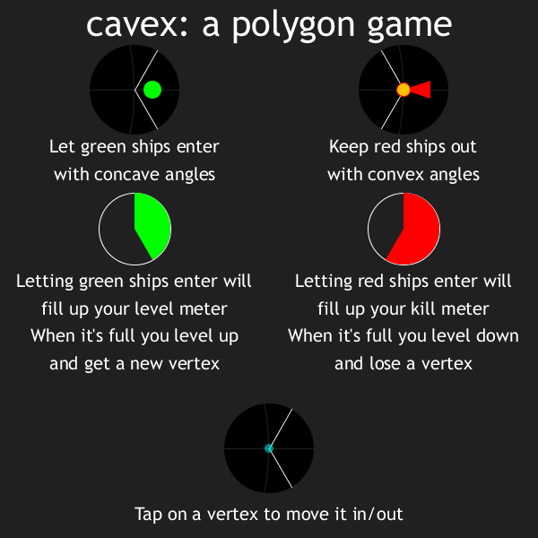

# cavex
### A polygon game

[Play it here online!](https://thijsvb.github.io/cavex)

[Or download from the Google Play Store!](https://play.google.com/store/apps/details?id=com.gmail.thijsvb.cavex)

cavex is a polygon game made in [Processing](http://processing.org), put online with [ProcessinJS](http://processingjs.org) and on Android with [Processing for Android](http://android.processing.org) and the [Ketai library](http://ketai.org).

Special thanks to redditors of ccKufi for giving some good feedback!
